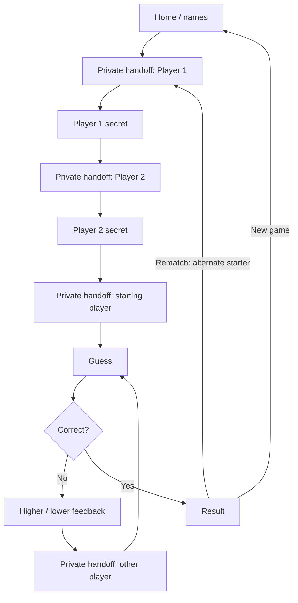

# Screens and interaction

## Navigation

Rematch always collects Player 1's secret first, then Player 2's; the first guessing player alternates independently. Rules open as a dismissible dialog from Home. Quit opens a confirmation dialog from setup, guess, or feedback and returns Home only after confirmation.

## 1. Home

Small Peek wordmark at the top; generous whitespace; mascot; headline **“A little guessing. A little luck.”**; subtext **“Pick a secret number. Find theirs first.”** Two stacked optional name fields, labelled Player 1 and Player 2, maximum 20 characters after trimming. Main button “Play together”; quiet “How to play” action. Footnote: “2 players · 1 device · 0–100”. A first-install cache indicator uses actual service-worker readiness: “Getting offline play ready…” then “Ready for offline play”. Failure says “Offline setup didn't finish. Retry”; current loaded play remains available.

## 2. Private handoff

Full opaque paper background. No number, history, range, feedback, or previous-screen content behind translucency. Small mascot and player color marker. Heading **“Pass to Maya.”** Body **“Only Maya should look next.”** Main button **“I'm Maya — ready”**. Seat label “Player 2” disambiguates identical names. Do not autofocus this button after the prior click; prevent click-through into the next screen.

## 3. Secret setup

Header “Your secret, Maya.” Supporting copy “Choose a whole number from 0 to 100.” Large masked number field with numeric input mode; explicit show/hide control; small note “Keep it to yourself.” Main button “Lock my number”. No auto-generated starting value. On validation failure show an inline error and focus the field; on success clear the displayed input and open the next handoff immediately. No edit path after lock-in; quit and restart if necessary.

## 4. Guess

Top row: small logo and labelled Quit action. Eyebrow “Maya's turn · Player 2”. Heading **“What's Sam's number?”** Large numerical entry; helper **“Possible range: 51–100”**; main button “Make guess”. Below a light divider, an expandable **“Your guesses (3)”** list, newest first, with value, arrow, and Higher/Lower text. Empty copy: “Your first guess starts here.” Other player's attempts and secret are absent. No countdown. Enter submits once when the number field is focused; it never dismisses the following feedback automatically.

## 5. Feedback

Replace the number entry with a large up/down icon and **“Higher”** or **“Lower”**, then “Their number is above 50” or “Their number is below 80”. Show updated possible range and last guess. Primary action “Pass to Sam” opens the privacy screen; do not advance on a timer. Feedback is for the player who just guessed, so retain their seat label.

## 6. Result

Mascot, **“Maya found it!”**, discovered number prominently, and “You guessed Sam's number in 5 tries.” Two compact rows reveal both secrets and each player's attempts, followed by the session score. Buttons “Play again” and “New game”. Say “Sam guesses first next round.” based on the previous starting player, not the winner. A correct first guess says “1 try”. Optional brief decorative celebration respects reduced motion; no sound in v1.

## Responsive and accessible behavior

Single column on all screen sizes; content width at most 440 px with 24 px side padding (16 px below 360 px). Keep primary actions in normal flow, clear of the virtual keyboard and safe-area inset. At 200% text size all controls remain reachable by scrolling. Visible input labels, logical tab order, clear focus rings, and 48 px minimum touch targets. Hints use text and arrows as well as color. On screen transition focus the new heading; announce submitted feedback politely. Do not announce secret values in live regions; explicit reveal may expose them to assistive technology. Browser Back must not reconstruct earlier private screens: use a single application route and state-based views.
